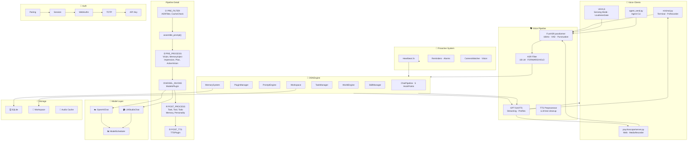

# DSN-exp

**Speak. It listens. It acts.** A voice-first AI companion that lives on your machine — wakes when you talk, remembers everything, reaches into your tools, and speaks back before you finish asking.

[](https://python.org)
[](LICENSE)
[](https://github.com/ccjjfdyqlhy/DSN-exp)

[Deep-dive into my codebase](REPORT.md)  

**English** | [简体中文](README_zh.md)

---

```
You walk in. It hears you.
  "Hey — remind me in an hour to push the build."
It processes while you grab coffee.
  "Done. Also, the build log looks clean."
You didn't ask it to check. It just knows what matters.
```

---

## Why Voice-First?

Most "AI assistants" are chat widgets bolted onto a cloud service. DSN-exp is the opposite:

- **Input**: Microphone → ASR (FunASR paraformer) → ASR Filter (1B classifier kills noise) → AI
- **Output**: AI → streaming TTS (GPT-SoVITS) per sentence → plays before the next sentence finishes
- **Proactive**: Heartbeat polls every 2s — reminders, alarms, even camera scene changes trigger AI to speak unprompted
- **Sensing Mode**: Continuous voice call — AI switches to short, colloquial responses, silence means listening
- **Everything talkable**: 50+ skills, 100+ tools, memory queries, alarm CRUD, music control, system ops — all through speech

**It doesn't wait for you to type. It lives in the same room. Not a cloud service. Not SaaS. A mind waking up from your own hard drive.**

---

## 🏗️ System Architecture



---

## 🎯 Core Positioning

| Feature | Description |
|---------|------------|
| **🎤 Voice-First** | ASR → TTS pipeline as primary modality, sensing mode for hands-free conversation |
| **🔒 Fully Private** | All data stored locally, SQLite encrypted, zero cloud dependency |
| **🧠 Long-Term Memory** | Auto-summarized dialogs + vector search, actually remembers what you said |
| **🎭 Multi-Personality** | YAML character cards + 50-dim personality vectors, supports personality distillation |
| **🌍 World Simulation** | Weather, time, location change dynamically — AI has its own "life" |
| **🛠️ 54+ Skills** | Search, files, GitHub, music, documents, system operations... |
| **⚡ Async Tasks** | Slow tools run in background, heartbeat polling for real-time feedback |
| **🔐 Multi-Layer Auth** | Pairing code / Session / WebAuthn / TOTP / API Key — 5 layers |
| **🤖 Agent API** | Dedicated interface for local AI agents, bidirectional memory sync |

---

## ✨ Detailed Features

### 🎤 Voice Interaction
- **Real-time ASR**: FunASR paraformer-zh with VAD, noise gate, punctuation restoration
- **Smart Filter**: 1B LM classifies speech as dialog (FORWARD) vs background noise (HOLD), prevents false triggers
- **Streaming TTS**: GPT-SoVITS per-sentence synthesis, plays as AI generates — no silence gaps
- **Multi-voice Profiles**: Switch voices at runtime, per-profile GPT/SoVITS weights
- **Sensing Mode**: Continuous conversation — AI drops markdown, uses colloquial short sentences, silence means "still listening"
- **TTS Preprocessing**: LLM-cleaner converts "AI 3秒后处理 HTTP 请求" → "人工智能三秒后处理超文本传输协议请求" — all lines are cleaned in a **single batched call** instead of one LLM round-trip per line (the first streaming line still uses a fast regex path)
- **Semantic Audio Cache**: L1 static + L2 vector + L3 slot — reuses synthesized audio for repeated queries

### 💬 Smart Chat
- **Dual Backend**: OpenAI-compatible API (DeepSeek/Zhipu/OpenAI) + local LMStudio
- **Native Tool Call**: OpenAI Function Calling, 100+ tools at your fingertips
- **Toolbox Mode**: Two-stage tool activation — the first round sends only a `toolbox` index, activated tools' schemas are attached afterwards. With ~100 tools this cuts per-task prompt tokens by ~69% (first round ~4.7k vs ~10.9k full). Ask "what can you do?" and the AI answers straight from the index without activating anything
- **History Trimming**: `MODEL_MAX_HISTORY` (default 12) caps conversation history so prompts stay small
- **Streaming Output**: Real-time generation, speaks as it types
- **Semantic Cache**: L1 static + L2 vector + L3 slot — intercepts duplicate requests

### 🧠 Memory System
- **Auto Summary**: LLM-driven compression, AES-256-GCM encrypted
- **Vector Search**: 768-dim semantic search, supports fuzzy queries
- **Global Memory**: Shared across all chats — true long-term memory
- **Memory Types**: Conversation summaries (`exp`) + manual memos (`memo`)

### 🎭 Personality System V3
- **Character Cards**: YAML format, supports natural language / corpus / experience entries
- **Distillation Engine**: Extracts personality traits from conversations, generates 50-dim vectors
- **Dynamic Synthesis**: Generates prompts based on current mood and context
- **Personality Dimensions**: Social, thinking, emotion, interests, behavior, values...
- **Background Throttling**: In `fastcache` mode, mood analysis and memory summarization run as deferred background tasks with per-user cooldowns, so local GPU inference doesn't fight the main reply

### 🌍 World System
- **World Engine**: Weather, time, location change automatically
- **Narrative Model**: Independent LLM instance, generates third-person narration
- **Action Narrator**: Collects AI actions, generates human-readable descriptions
- **World Presets**: Default world + custom world configs

### 🛠️ Skill System
- **54+ Built-in Skills**:
  - 🔍 `web_search` — Web search
  - 📂 `file_manager` — File management
  - 🐙 `github` — GitHub operations
  - 🎵 `ncm_music` — NetEase Cloud Music
  - 📄 `document` — Document processing (scanner/printer)
  - 💻 `system` — System operations
  - 🧠 `plan` — Plan management
  - 🔧 `browser_use` — Browser automation
  - 📝 `todo` — Todo list
  - 🎭 `impression` — Impression system
  - 🧪 `skillmgr` — Skill management
  - ...
- **Custom Skills**: YAML config, supports async execution
- **Skill Distillation**: Learns from usage, optimizes tool calls

### ⏰ Proactive Notification System
- **Heartbeat**: Every 2s the voice client polls for pending notifications
- **Reminders**: Countdown, daily plan, periodic cron, habits — all fire AI + TTS
- **Alarms**: Full CRUD, weekly schedules, dismiss with voice command
- **Active Vision**: CameraWatcher captures frames → VisionModel detects scene changes → AI decides to speak

### ⚡ Task System
- **Complexity Analysis**: Automatically determines if async execution is needed
- **Async Tasks**: Slow tools run in background
- **Heartbeat Polling**: Frontend polls for async results
- **Real-time Feedback**: Per-step TTS progress in Agent loop
- **Step-limit Report**: If the Agent burns through all steps while still executing tools, one extra round summarizes the tool results to the user instead of stopping silently

### 🖼️ Vision System
- **VisionModel**: General vision model (GLM-4.6V / GPT-4V)
- **OCRModel**: Document OCR, supports deepseek-ocr
- **VISION_OVERRIDE**: Takes over OCR + 2md pipeline, generates Markdown directly
- **Image Analysis**: `describe_image` tool supports local images
- **Active Vision**: Background CameraWatcher for proactive scene awareness
- **Parallel Multi-Camera**: `look_around` describes every camera in parallel (results ordered by logical name), halving multi-cam latency
- **On-Demand Frame Cache**: The client caches the latest frame per camera; vision requests reuse fresh frames with no re-open latency, and the heartbeat dropped to 2s so requests are picked up almost instantly
- **VLM Warmup**: A background dummy request at boot removes the first-call cold start (first VLM inference can otherwise take ~9s)
- **Look-around Dedup**: Repeated `look_around` within a short window reuses the last result instead of re-running capture + inference
- **Fail-fast Fallback**: If the client is offline, `look_around` returns a fallback after 8s (was 20s) instead of hanging the whole reply

### 🔐 Auth System
| Layer | Method | Priority | Use Case |
|-------|--------|----------|----------|
| L4 | API Key | 1 | Agent API / Automation |
| L1 | Session | 2 | Terminal / Web UI |
| L2 | WebAuthn | 3 | Passkey login |
| L3 | TOTP | 4 | Two-factor auth |
| L0 | Pairing Code | 5 | First-time device pairing |

### 🧩 Other Features
- **Workspace System**: User-isolated directories, AI notes / scans / code repos
- **Document System**: Scanner/printer support, `.hmd` format
- **Maintenance System**: Auto memory compression / personality distillation / log cleanup
- **Semantic Cache**: Intercepts duplicate requests, saves tokens
- **Agent API**: Dedicated interface for local AI agents

---

## 🚀 Quick Start

### Minimal Setup (3 steps)

#### 1️⃣ Clone & Install
```bash
git clone https://github.com/ccjjfdyqlhy/DSN-exp
cd DSN-exp
pip install -r requirements.txt
```

#### 2️⃣ Configure (auto-guided)
```bash
python main.py
```

First run launches an interactive setup wizard that asks:
- API choice: cloud API or local model
- API Key and Base URL
- Main model selection
- Whether to enable core features

The wizard auto-generates your `.env` file.

#### 3️⃣ Connect a Client
```bash
# Terminal voice client (press Enter, speak, release)
python psychoscope/minimal.py

# Web interface (supports sensing mode)
python psychoscope/server.py
# Then visit http://localhost:5000
```

**That's it!** You can start talking now.

---

### Common Setup Scenarios

#### 🌐 Scenario 1: Pure DeepSeek (simplest)
```bash
# .env (auto-generated by wizard)
OPENAI_API_KEY=sk-your-deepseek-key
OPENAI_API_BASE=https://api.deepseek.com/v1
MAIN_MODEL_NAME=deepseek-v4-flash
```

#### 🏠 Scenario 2: Local LMStudio
```bash
# .env
MAIN_MODEL_TYPE=lmstudio
MAIN_MODEL_NAME=llama-3-8b-instruct
LMSTUDIO_BASE_URL=http://localhost:4501

# Start LMStudio first, load a model
# Then start DSN-exp
python main.py
python psychoscope/minimal.py
```

#### 🎯 Scenario 3: Zhipu GLM
```bash
# .env
OPENAI_API_KEY=your-zhipu-key
OPENAI_API_BASE=https://open.bigmodel.cn/api/paas/v4
MAIN_MODEL_NAME=glm-4.7
VISION_API_KEY=your-zhipu-key
VISION_MODEL_NAME=glm-4.6v
```

#### 🤖 Scenario 4: Agent API
```bash
# Server console: create an agent
/agent create MyAgent 1
# → outputs API Key

# Agent sends a message
python agent_send.py "analyze code complexity"
```

---

## 📂 Project Structure

```
DSN-exp/
├── 🚀 Core
│   ├── main.py                 # Server entry + console
│   ├── engine.py               # DSNEngine core engine
│   ├── boot.py                 # Flask app initialization + ASR/TTS models
│   ├── config.py               # Configuration management
│   └── onboarding.py           # First-run setup wizard
│
├── 🔌 Plugin System
│   ├── plugins/
│   │   ├── base.py             # Plugin base class + HookPoint
│   │   ├── manager.py          # PluginManager
│   │   ├── pipeline.py         # ChatPipeline
│   │   └── builtin/            # Built-in plugins
│   │       ├── models_plugin.py    # Model invocation
│   │       ├── memory_plugin.py    # Memory system
│   │       ├── vision_plugin.py    # Vision system
│   │       ├── task_plugin.py      # Task management
│   │       ├── tts_plugin.py       # TTS synthesis
│   │       ├── tts_profile.py      # TTS profile management
│   │       ├── asr_filter_plugin.py # ASR voice filter
│   │       ├── active_vision_plugin.py # Camera watcher
│   │       └── ...
│   │   └── custom/             # Custom plugins
│
├── 🧠 Memory System
│   ├── memory/core.py          # MemorySystem core class
│   └── semantic_cache/         # Semantic cache (L1/L2/L3)
│
├── 🎭 Personality System
│   ├── prompt/personality_v3/  # PersonalitySystemV3
│   │   ├── character_card.py   # Character card definitions
│   │   ├── distillation_engine.py  # Distillation engine
│   │   ├── dynamic_synthesizer.py # Dynamic synthesizer
│   │   ├── traits.py           # 50-dim personality vectors
│   │   └── ...
│   ├── prompt/personality_v2/  # PersonalitySystemV2
│   ├── prompt/library.py       # PromptLibrary
│   ├── prompt/engine.py        # PromptEngine
│   └── character_cards/        # YAML character cards
│
├── 🌍 World System
│   ├── world/
│   │   ├── engine.py           # WorldEngine
│   │   ├── state_manager.py    # WorldStateManager
│   │   ├── narrative_model.py  # NarrativeModel
│   │   ├── action_narrator.py  # Action narration
│   │   └── worlds/             # World configs
│
├── 🛠️ Skill System
│   ├── skills/
│   │   ├── registry.py         # SkillRegistry
│   │   ├── manager.py          # SkillManager
│   │   ├── builtin/            # 54+ built-in skills
│   │   ├── custom/             # Custom skills
│   │   ├── distilled/          # Distilled skills
│   │   └── system/             # System skills
│
├── ⚡ Task System
│   ├── tasks.py                # TaskManager + ComplexityAnalyzer
│   ├── maintenance/            # Background tasks
│   └── async_task_store.py     # Async task storage
│
├── 🤖 Model Clients
│   ├── models/
│   │   ├── clients.py          # OpenAIChat + LMStudioChat
│   │   ├── scheduler.py        # ModelScheduler
│   │   ├── tts_process.py      # TTS preprocessing
│   │   └── asr_filter.py       # ASR filtering (1B LM)
│
├── 🔐 Auth System
│   ├── auth/
│   │   ├── auth_manager.py     # AuthManager
│   │   ├── api_key_manager.py  # API Key management
│   │   ├── webauthn_manager.py # WebAuthn
│   │   ├── totp_manager.py     # TOTP
│   │   ├── pairing.py          # Pairing code
│   │   ├── session.py          # Session management
│   │   └── endpoints.py        # Auth API endpoints
│
├── 💾 Database
│   ├── db/
│   │   ├── chat.py             # ChatDBManager
│   │   ├── plan_store.py       # Plan storage
│   │   └── plan_engine.py      # Plan engine
│
├── 🖼️ Vision System
│   ├── document/               # Document processing (.hmd)
│   └── models/clients.py       # VisionModel + OCRModel
│
├── 🎤 Audio System
│   ├── audio/infer.py          # VocalExp — GPT-SoVITS client
│   └── TTS_profiles/           # TTS voice profiles
│
├── 🗣️ Voice API
│   ├── api/app.py              # ASR recognize + passthrough endpoints
│   ├── api/heartbeat.py        # Heartbeat notification polling
│   └── api/alarm.py            # Alarm CRUD + dismiss
│
├── 🖥️ Frontend Clients
│   ├── psychoscope/
│   │   ├── server.py           # Web server
│   │   ├── minimal.py          # Terminal voice client
│   │   └── static/
│   │       ├── index.html
│   │       ├── js/app.js       # Main web app
│   │       ├── js/voice.js     # Browser sensing mode
│   │       └── js/typewriter.js
│   └── agent_send.py           # Agent CLI
│
├── 📊 Configuration
│   ├── .env.example            # Config example
│   ├── model_profiles/         # Model configs
│   └── world/worlds/           # World configs
│
├── 🧪 Tests & Docs
│   ├── tests/                  # Tests
│   ├── docs/                   # Documentation
│   ├── REPORT.md               # Tech report
│   └── GOALS.md                # Development goals
│
└── 📂 Workspace & Cache
    ├── .dsn/workspace/         # User workspace
    ├── logs/                   # Logs (including ASR/TTS debug)
    └── temp/                   # Temp files
```

---

## 📦 Core Module Breakdown

### 🎤 Voice Pipeline

**Three-stage voice processing: ASR → Filter → AI → TTS**

```
Microphone → PCM 16kHz → FunASR (VAD + Recognition) → ASR Filter (FORWARD/HOLD)
                                                              │
                                                              ├── FORWARD → ChatPipeline → GPT-SoVITS TTS → Speaker
                                                              └── HOLD → discarded (logged to memory as ambient)
```

**Components:**
- **FunASR**: paraformer-zh model, VAD with fsmn-vad, punctuation with ct-punc-c, configurable device (CUDA/CPU)
- **ASR Filter**: 1B LMStudio model classifies input as dialog vs noise, prevents false triggers, maintains 20-round conversation history
- **GPT-SoVITS TTS**: Streaming synthesis via REST API, supports parallel/serial architectures, multi-profile voice switching
- **TTS Preprocessor**: Two-stage cleanup — regex strips markdown, LLM converts numerals/abbreviations to natural speech. Lines are processed in one batched call (first streaming line uses a local regex fast path)
- **Semantic Audio Cache**: L1 static phrase + L2 vector semantic + L3 slot registry

### 🔄 ChatPipeline
**5 HookPoints — full conversation lifecycle management**

| HookPoint | Trigger | Purpose |
|-----------|---------|---------|
| PRE_FILTER | Before pipeline | ASR filter, semantic cache check, short-circuit on HOLD |
| PRE_PROCESS | Before model call | Memory injection, vision processing, active vision, impression, plan |
| MODEL_INVOKE | Model call | OpenAI/LMStudio invoke, tool delivery, agent loop |
| POST_PROCESS | After output | Task execution, tool calls, memory update, personality update |
| POST_TTS | After text ready | TTS synthesis, caching, audio delivery |

### 🧠 MemorySystem
**Two-layer architecture: summary + vector search**

```
Dialog → LMSummaryModel → Compressed Summary → AES-256 Encrypt → SQLite
         ↓
    EmbeddingClient → 768-dim Vector → Semantic Search
```

**Features:**
- Auto-summary: compresses conversations every N rounds
- Vector search: supports fuzzy semantic search
- Global memory: shared across all chats
- Encrypted storage: AES-256-GCM protects privacy

### 🎭 PersonalitySystemV3
**50-dim personality vectors — real personality modeling**

**Core components:**
- **CharacterCard**: YAML character cards, supports natural language / corpus / experience entries
- **DistillationEngine**: Extracts personality traits from conversations
- **DynamicSynthesizer**: Generates prompts based on mood and context
- **PersonalityJudge**: 50-dim personality vectors: social / thinking / emotion / interests / behavior / values

**Workflow:**
```
Character Card (YAML) → Distillation Engine → 50-dim Vector → Dynamic Synthesizer → Prompt → Model
```

### 🌍 WorldSystem
**AI has its own "life"**

**Components:**
- **WorldEngine**: World state management (weather / time / location)
- **WorldStateManager**: State updates and event triggers
- **NarrativeModel**: Independent LLM instance, generates narration
- **ActionNarrator**: Collects AI actions, generates descriptions

**Example:**
```
World: default
Weather: sunny ☀️
Time: 2026-07-03 14:30
Location: study 📚
Narration: Sunlight streams through the window onto the desk. The AI is pondering the user's request...
```

### 🛠️ SkillSystem
**54+ built-in skills + custom skills**

**Skill structure:**
```yaml
name: web_search
description: Search the web
version: 1.0
tools:
  - name: search
    description: Execute a web search
    parameters:
      query:
        type: string
        description: Search keywords
```

**Built-in skill list:**
- 🔍 `web_search` — Web search
- 📂 `file_manager` — File management
- 🐙 `github` — GitHub operations
- 🎵 `ncm_music` — NetEase Cloud Music
- 📄 `document` — Document processing
- 💻 `system` — System operations
- 🧠 `plan` — Plan management
- 🔧 `browser_use` — Browser automation
- 📝 `todo` — Todo list
- 🎭 `impression` — Impression system
- 🧪 `skillmgr` — Skill management
- ...

### ⏰ Proactive System
**Heartbeat-driven proactive AI voice notifications**

```
(wall clock ticks) → TaskManager triggers → task_notifications table
                                                    ↓
HeartbeatPoller (2s) → GET /api/heartbeat → has_notification?
                                                    ├── yes → build prompt → AI reply → TTS → speak
                                                    └── no  → sleep
```

**Trigger sources:**
- **Reminders**: Countdown, daily plan, periodic cron, habit check-in
- **Alarms**: Weekly schedules with dismiss (8-day snooze)
- **Active Vision**: CameraWatcher background frame capture → VisionModel scene analysis → change detection

### ⚡ TaskSystem
**Smart async, real-time feedback**

**Features:**
- **Complexity analysis**: Automatically determines if async is needed
- **Async tasks**: Slow tools run in background
- **Heartbeat polling**: Frontend polls for results
- **Real-time feedback**: Per-step TTS progress push in Agent loop

**Workflow:**
```
User Request → Complexity Analysis → High complexity? → Async Task → Heartbeat Polling → Result
                                  ↓
                               Low complexity → Sync Execute → Direct Return
```

### 🔐 AuthSystem
**5-layer protection, fully under your control**

**Auth layers:**
1. **L4 API Key**: Programmatic access, Agent API
2. **L1 Session**: Terminal / Web UI login
3. **L2 WebAuthn**: Passkey, hardware auth
4. **L3 TOTP**: Time-based two-factor auth
5. **L0 Pairing Code**: First-time device pairing

**Example flow:**
```bash
# 1. Generate pairing code
/newbind
# → Pairing code: 12345678 (valid for 8 minutes)

# 2. Client submits
POST /api/auth/pairing/verify
{"code": "12345678"}

# 3. Returns Session
{"session": "eyJhbGciOiJIUzI1NiIs..."}
```

### 🖼️ VisionSystem
**Multi-modal perception**

**Components:**
- **VisionModel**: General vision model (GLM-4.6V / GPT-4V)
- **OCRModel**: Document OCR (deepseek-ocr)
- **VISION_OVERRIDE**: Takes over OCR + 2md pipeline

**Vision pipeline:**
```
Image → VisionModel → Description Text
Document → OCRModel → Markdown → .hmd
```

---

## 🎮 Usage Tips

### Terminal Voice Client Shortcuts
```
[Enter]  Hold to record, release to send
[a x2]   Lock / Unlock panel
[b x2]   Music Player mode
[p]      Show personality status
[s]      Toggle standby / wakeup
[i]      System info
[k]      Skip latest reminder
[f]      Silence alarm + stop TTS
[r]      Trigger heartbeat now
[t]      Text input (sync)
[=]      Async task (long-running)
[h]      Show help
[q/Ctrl+C] Quit
```

### Server Console Commands
```
/newbind           - Generate new pairing code
/users             - List all users
/status            - Server status summary
/agent create      - Create an Agent
/agent bind        - Bind Agent to user
/memory query      - Search memory
/memory reindex    - Rebuild vector index
/hibernate sleep   - Enter standby
/config set        - Modify config at runtime
/stop              - Stop server
```

### API Examples
```bash
# Send a message
curl -X POST http://localhost:5000/api/chat/send \
  -H "Authorization: Bearer YOUR_SESSION" \
  -H "Content-Type: application/json" \
  -d '{"message": "Hello"}'

# Voice passthrough (ASR → AI → TTS)
curl -X POST http://localhost:5000/api/asr/passthrough \
  -H "Authorization: Bearer YOUR_SESSION" \
  -H "Content-Type: application/json" \
  -d '{"audio_b64": "BASE64_WAV_DATA"}'

# Agent sends a message
python agent_send.py "analyze code complexity"

# Search memory
curl "http://localhost:5000/api/memory/query?q=Python+project&limit=5"
```

---

## ⚙️ Configuration

### Minimal Config (required)
```bash
OPENAI_API_KEY=sk-your-key              # API key
OPENAI_API_BASE=https://api.deepseek.com/v1  # API base URL
MAIN_MODEL_NAME=deepseek-v4-flash       # Main model
```

### Voice-Enabled Config (recommended)
```bash
# Voice
ASR_ENABLED=true
ASR_DEVICE=cuda
TTS_BASE_URL=http://127.0.0.1:9880
TTS_PROCESS_ENABLED=true

# Main model
MAIN_MODEL_TYPE=openai
MAIN_MODEL_NAME=deepseek-v4-flash

# Memory system
MEMORY_ENABLED=true
MEMORY_EMBEDDING_ENABLED=true

# Personality system
PERSONALITY_V3_ENABLED=true

# World system
WORLD_ENABLED=true
NARRATIVE_ENABLED=true

# Semantic cache
SEMANTIC_CACHE_ENABLED=true
```

### Performance & Perception Tuning
```bash
# Toolbox: send only the toolbox index first, attach activated tool schemas later
TOOLBOX_ENABLED=true

# Cap main-model history (non-system messages kept)
MODEL_MAX_HISTORY=12

# Agent max steps; a final report round is always issued if steps run out mid-task
AGENT_MAX_STEPS=15

# Vision: warm the VLM at boot, dedup repeated look_around within the window (s)
VISION_WARMUP=true
VISION_LOOK_AROUND_DEDUP=10

# Client-side (minimal.py): heartbeat interval (s) and cached-frame freshness (s)
#   DSN_HEARTBEAT_INTERVAL=2
#   DSN_FRAME_CACHE_MAX_AGE=3

# Background throttling for local-GPU tasks (s)
HIBERNATE_PERSONALITY_COOLDOWN=30
HIBERNATE_MEMORY_COOLDOWN=60
```

### Full Config Reference
See [`.env.example`](.env.example) for all configuration options.

---

## 📄 License

MIT License — see the [LICENSE](LICENSE) file for details.

---

**[⬆ Back to top](#-dsn-exp)**

Made with ❤️ by [Darkstar](https://github.com/ccjjfdyqlhy)
