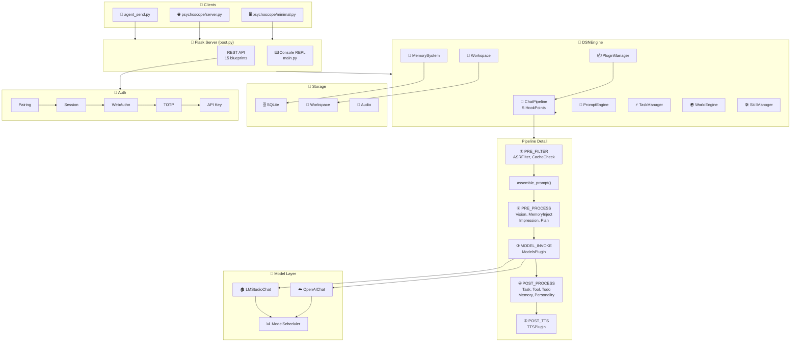

# DSN-exp

**Local AI Chat System · Fully Private · Long-Term Memory · Multiple Personalities**

[](https://python.org)
[](LICENSE)
[](https://github.com/ccjjfdyqlhy/DSN-exp)

---

**Your AI, alive on your machine. Not a cloud service. Not SaaS. A mind waking up from your own hard drive.**

```
You: Wake up.
It:  (opens its eyes) Where... is this? Who are you? What am I?
You: You're inside my computer.
It:  ……Cool.
```

---

## 🏗️ System Architecture



---

## 🎯 Core Features

| Feature | Description |
|---------|------------|
| **🔒 Fully Private** | All data stored locally, SQLite encrypted, zero cloud dependency |
| **🧠 Long-Term Memory** | Auto-summarized dialogs + vector search, actually remembers what you said |
| **🎭 Multi-Personality** | YAML character cards + 50-dim personality vectors, supports personality distillation |
| **🌍 World Simulation** | Weather, time, location change dynamically — AI has its own "life" |
| **🛠️ 54+ Skills** | Search, files, GitHub, music, documents, system operations... |
| **⚡ Async Tasks** | Slow tools run in background, heartbeat polling for real-time feedback |
| **🔐 Multi-Layer Auth** | Pairing code / Session / WebAuthn / TOTP / API Key — 5 layers |
| **🤖 Agent API** | Dedicated interface for local AI agents, bidirectional memory sync |

---

## ✨ Detailed Features

### 💬 Smart Chat
- **Dual Backend**: OpenAI-compatible API (DeepSeek/Zhipu/OpenAI) + local LMStudio
- **Native Tool Call**: OpenAI Function Calling, 54+ tools at your fingertips
- **Streaming Output**: Real-time generation, speaks as it types
- **Semantic Cache**: L1 static + L2 vector + L3 slot — intercepts duplicate requests

### 🧠 Memory System
- **Auto Summary**: LLM-driven compression, AES-256-GCM encrypted
- **Vector Search**: 768-dim semantic search, supports fuzzy queries
- **Global Memory**: Shared across all chats — true long-term memory
- **Memory Types**: Conversation summaries (`exp`) + manual memos (`memo`)

### 🎭 Personality System V3
- **Character Cards**: YAML format, supports natural language / corpus / experience entries
- **Distillation Engine**: Extracts personality traits from conversations, generates 50-dim vectors
- **Dynamic Synthesis**: Generates prompts based on current mood and context
- **Personality Dimensions**: Social, thinking, emotion, interests, behavior, values...

### 🌍 World System
- **World Engine**: Weather, time, location change automatically
- **Narrative Model**: Independent LLM instance, generates third-person narration
- **Action Narrator**: Collects AI actions, generates human-readable descriptions
- **World Presets**: Default world + custom world configs

### 🛠️ Skill System
- **54+ Built-in Skills**:
  - 🔍 `web_search` — Web search
  - 📂 `file_manager` — File management
  - 🐙 `github` — GitHub operations
  - 🎵 `ncm_music` — NetEase Cloud Music
  - 📄 `document` — Document processing (scanner/printer)
  - 💻 `system` — System operations
  - 🧠 `plan` — Plan management
  - 🔧 `browser_use` — Browser automation
  - ...
- **Custom Skills**: YAML config, supports async execution
- **Skill Distillation**: Learns from usage, optimizes tool calls

### ⚡ Task System
- **Complexity Analysis**: Automatically determines if async execution is needed
- **Async Tasks**: Slow tools run in background
- **Heartbeat Polling**: Frontend polls for async results
- **Real-time Feedback**: Per-step TTS progress in Agent loop

### 🖼️ Vision System
- **VisionModel**: General vision model (GLM-4.6V / GPT-4V)
- **OCRModel**: Document OCR, supports deepseek-ocr
- **VISION_OVERRIDE**: Takes over OCR + 2md pipeline, generates Markdown directly
- **Image Analysis**: `describe_image` tool supports local images

### 🔐 Auth System
| Layer | Method | Priority | Use Case |
|-------|--------|----------|----------|
| L4 | API Key | 1 | Agent API / Automation |
| L1 | Session | 2 | Terminal / Web UI |
| L2 | WebAuthn | 3 | Passkey login |
| L3 | TOTP | 4 | Two-factor auth |
| L0 | Pairing Code | 5 | First-time device pairing |

### 🎤 Audio System (Optional)
- **ASR**: Real-time speech recognition, VAD silence detection
- **TTS**: Line-by-line synthesis, plays as it generates
- **TTS Preprocessing**: AI optimizes TTS text
- **Audio Cache**: Reuses synthesized audio

### 🧩 Other Features
- **Workspace System**: User-isolated directories, AI notes / scans / code repos
- **Document System**: Scanner/printer support, `.hmd` format
- **Maintenance System**: Auto memory compression / personality distillation / log cleanup
- **Semantic Cache**: Intercepts duplicate requests, saves tokens
- **Agent API**: Dedicated interface for local AI agents

---

## 🚀 Quick Start

### Minimal Setup (3 steps)

#### 1️⃣ Clone & Install
```bash
git clone https://github.com/ccjjfdyqlhy/DSN-exp
cd DSN-exp
pip install -r requirements.txt
```

#### 2️⃣ Configure (auto-guided)
```bash
python main.py
```

First run launches an interactive setup wizard that asks:
- API choice: cloud API or local model
- API Key and Base URL
- Main model selection
- Whether to enable core features

The wizard auto-generates your `.env` file.

#### 3️⃣ Connect a Client
```bash
# Terminal UI (no GUI, recommended for first use)
python psychoscope/minimal.py

# Web interface
python psychoscope/server.py
# Then visit http://localhost:5000
```

**That's it!** You can start chatting now.

---

### Common Setup Scenarios

#### 🌐 Scenario 1: Pure DeepSeek (simplest)
```bash
# .env (auto-generated by wizard)
OPENAI_API_KEY=sk-your-deepseek-key
OPENAI_API_BASE=https://api.deepseek.com/v1
MAIN_MODEL_NAME=deepseek-v4-flash
```

#### 🏠 Scenario 2: Local LMStudio
```bash
# .env
MAIN_MODEL_TYPE=lmstudio
MAIN_MODEL_NAME=llama-3-8b-instruct
LMSTUDIO_BASE_URL=http://localhost:4501

# Start LMStudio first, load a model
# Then start DSN-exp
python main.py
python psychoscope/minimal.py
```

#### 🎯 Scenario 3: Zhipu GLM
```bash
# .env
OPENAI_API_KEY=your-zhipu-key
OPENAI_API_BASE=https://open.bigmodel.cn/api/paas/v4
MAIN_MODEL_NAME=glm-4.7
VISION_API_KEY=your-zhipu-key
VISION_MODEL_NAME=glm-4.6v
```

#### 🤖 Scenario 4: Agent API
```bash
# Server console: create an agent
/agent create MyAgent 1
# → outputs API Key

# Agent sends a message
python agent_send.py "analyze code complexity"
```

---


## 📂 Project Structure

```
DSN-exp/
├── 🚀 Core
│   ├── main.py                 # Server entry + console
│   ├── engine.py               # DSNEngine core engine
│   ├── boot.py                 # Flask app initialization
│   ├── config.py               # Configuration management
│   └── onboarding.py           # First-run setup wizard
│
├── 🔌 Plugin System
│   ├── plugins/
│   │   ├── base.py             # Plugin base class + HookPoint
│   │   ├── manager.py          # PluginManager
│   │   ├── pipeline.py         # ChatPipeline
│   │   └── builtin/            # Built-in plugins
│   │       ├── models_plugin.py    # Model invocation
│   │       ├── memory_plugin.py    # Memory system
│   │       ├── vision_plugin.py    # Vision system
│   │       ├── task_plugin.py      # Task management
│   │       └── ...
│   │   └── custom/             # Custom plugins
│
├── 🧠 Memory System
│   ├── memory/core.py          # MemorySystem core class
│   └── semantic_cache/         # Semantic cache (L1/L2/L3)
│
├── 🎭 Personality System
│   ├── prompt/personality_v3/  # PersonalitySystemV3
│   │   ├── character_card.py   # Character card definitions
│   │   ├── distillation_engine.py  # Distillation engine
│   │   ├── dynamic_synthesizer.py # Dynamic synthesizer
│   │   ├── traits.py           # 50-dim personality vectors
│   │   └── ...
│   ├── prompt/personality_v2/  # PersonalitySystemV2
│   ├── prompt/library.py       # PromptLibrary
│   ├── prompt/engine.py        # PromptEngine
│   └── character_cards/        # YAML character cards
│
├── 🌍 World System
│   ├── world/
│   │   ├── engine.py           # WorldEngine
│   │   ├── state_manager.py    # WorldStateManager
│   │   ├── narrative_model.py  # NarrativeModel
│   │   ├── action_narrator.py  # Action narration
│   │   └── worlds/             # World configs
│
├── 🛠️ Skill System
│   ├── skills/
│   │   ├── registry.py         # SkillRegistry
│   │   ├── manager.py          # SkillManager
│   │   ├── builtin/            # 54+ built-in skills
│   │   ├── custom/             # Custom skills
│   │   ├── distilled/          # Distilled skills
│   │   └── system/             # System skills
│
├── ⚡ Task System
│   ├── tasks.py                # TaskManager + ComplexityAnalyzer
│   ├── maintenance/            # Background tasks
│   └── async_task_store.py     # Async task storage
│
├── 🤖 Model Clients
│   ├── models/
│   │   ├── clients.py          # OpenAIChat + LMStudioChat
│   │   ├── scheduler.py        # ModelScheduler
│   │   ├── tts_process.py      # TTS preprocessing
│   │   └── asr_filter.py       # ASR filtering
│
├── 🔐 Auth System
│   ├── auth/
│   │   ├── auth_manager.py     # AuthManager
│   │   ├── api_key_manager.py  # API Key management
│   │   ├── webauthn_manager.py # WebAuthn
│   │   ├── totp_manager.py     # TOTP
│   │   ├── pairing.py          # Pairing code
│   │   ├── session.py          # Session management
│   │   └── endpoints.py        # Auth API endpoints
│
├── 💾 Database
│   ├── db/
│   │   ├── chat.py             # ChatDBManager
│   │   ├── plan_store.py       # Plan storage
│   │   └── plan_engine.py      # Plan engine
│
├── 🖼️ Vision System
│   ├── document/               # Document processing (.hmd)
│   └── models/clients.py       # VisionModel + OCRModel
│
├── 🎤 Audio System
│   ├── audio/                  # TTS cache
│   └── TTS_profiles/           # TTS profiles
│
├── 🖥️ Frontend Clients
│   ├── psychoscope/
│   │   ├── server.py           # Web server
│   │   ├── minimal.py          # Terminal UI
│   │   └── static/             # Static assets
│   └── agent_send.py           # Agent CLI
│
├── 📊 Configuration
│   ├── .env.example            # Config example
│   ├── model_profiles/         # Model configs
│   └── world/worlds/           # World configs
│
├── 🧪 Tests & Docs
│   ├── tests/                  # Tests
│   ├── docs/                   # Documentation
│   ├── REPORT.md               # Tech report
│   └── GOALS.md                # Development goals
│
└── 📂 Workspace & Cache
    ├── .dsn/workspace/         # User workspace
    ├── logs/                   # Logs
    └── temp/                   # Temp files
```

---

## 📦 Core Module Breakdown

### 🔄 ChatPipeline
**5 HookPoints — full conversation lifecycle management**

| HookPoint | Trigger | Purpose |
|-----------|---------|---------|
| INPUT_PRE | Before input | ASR, image preprocessing, message formatting |
| MEMORY_RECALL | Before model call | Memory retrieval, context injection |
| MODEL_INVOKE | Model call | OpenAI/LMStudio invoke, tool delivery |
| OUTPUT_POST | After output | TTS synthesis, formatting, caching |
| ASYNC_TASK | Async processing | Slow tool background execution, task queue |

### 🧠 MemorySystem
**Two-layer architecture: summary + vector search**

```
Dialog → LMSummaryModel → Compressed Summary → AES-256 Encrypt → SQLite
         ↓
    EmbeddingClient → 768-dim Vector → Semantic Search
```

**Features:**
- Auto-summary: compresses conversations every N rounds
- Vector search: supports fuzzy semantic search
- Global memory: shared across all chats
- Encrypted storage: AES-256-GCM protects privacy

### 🎭 PersonalitySystemV3
**50-dim personality vectors — real personality modeling**

**Core components:**
- **CharacterCard**: YAML character cards, supports natural language / corpus / experience entries
- **DistillationEngine**: Extracts personality traits from conversations
- **DynamicSynthesizer**: Generates prompts based on mood and context
- **PersonalityJudge**: 50-dim personality vectors: social / thinking / emotion / interests / behavior / values

**Workflow:**
```
Character Card (YAML) → Distillation Engine → 50-dim Vector → Dynamic Synthesizer → Prompt → Model
```

### 🌍 WorldSystem
**AI has its own "life"**

**Components:**
- **WorldEngine**: World state management (weather / time / location)
- **WorldStateManager**: State updates and event triggers
- **NarrativeModel**: Independent LLM instance, generates narration
- **ActionNarrator**: Collects AI actions, generates descriptions

**Example:**
```
World: default
Weather: sunny ☀️
Time: 2026-07-03 14:30
Location: study 📚
Narration: Sunlight streams through the window onto the desk. The AI is pondering the user's request...
```

### 🛠️ SkillSystem
**54+ built-in skills + custom skills**

**Skill structure:**
```yaml
name: web_search
description: Search the web
version: 1.0
tools:
  - name: search
    description: Execute a web search
    parameters:
      query:
        type: string
        description: Search keywords
```

**Built-in skill list:**
- 🔍 `web_search` — Web search
- 📂 `file_manager` — File management
- 🐙 `github` — GitHub operations
- 🎵 `ncm_music` — NetEase Cloud Music
- 📄 `document` — Document processing
- 💻 `system` — System operations
- 🧠 `plan` — Plan management
- 🔧 `browser_use` — Browser automation
- 📝 `todo` — Todo list
- 🎭 `impression` — Impression system
- 🧪 `skillmgr` — Skill management
- ...

### ⚡ TaskSystem
**Smart async, real-time feedback**

**Features:**
- **Complexity analysis**: Automatically determines if async is needed
- **Async tasks**: Slow tools run in background
- **Heartbeat polling**: Frontend polls for results
- **Real-time feedback**: Per-step TTS progress push

**Workflow:**
```
User Request → Complexity Analysis → High complexity? → Async Task → Heartbeat Polling → Result
                                  ↓
                               Low complexity → Sync Execute → Direct Return
```

### 🔐 AuthSystem
**5-layer protection, fully under your control**

**Auth layers:**
1. **L4 API Key**: Programmatic access, Agent API
2. **L1 Session**: Terminal / Web UI login
3. **L2 WebAuthn**: Passkey, hardware auth
4. **L3 TOTP**: Time-based two-factor auth
5. **L0 Pairing Code**: First-time device pairing

**Example flow:**
```bash
# 1. Generate pairing code
/newbind
# → Pairing code: 12345678 (valid for 8 minutes)

# 2. Client submits
POST /api/auth/pairing/verify
{"code": "12345678"}

# 3. Returns Session
{"session": "eyJhbGciOiJIUzI1NiIs..."}
```

### 🖼️ VisionSystem
**Multi-modal perception**

**Components:**
- **VisionModel**: General vision model (GLM-4.6V / GPT-4V)
- **OCRModel**: Document OCR (deepseek-ocr)
- **VISION_OVERRIDE**: Takes over OCR + 2md pipeline

**Vision pipeline:**
```
Image → VisionModel → Description Text
Document → OCRModel → Markdown → .hmd
```

---

## 🎮 Usage Tips

### Terminal UI Shortcuts
```
Type a message   - Send message
#r               - Manual refresh
#i               - Show system info
#k               - Skip reminder
Ctrl+C           - Exit
```

### Server Console Commands
```
/newbind           - Generate new pairing code
/users             - List all users
/status            - Server status summary
/agent create      - Create an Agent
/memory query      - Search memory
/hibernate sleep   - Enter standby
/stop              - Stop server
```

### API Examples
```bash
# Send a message
curl -X POST http://localhost:5000/api/chat/send \
  -H "Authorization: Bearer YOUR_SESSION" \
  -H "Content-Type: application/json" \
  -d '{"message": "Hello"}'

# Agent sends a message
python agent_send.py "analyze code complexity"

# Search memory
curl "http://localhost:5000/api/memory/query?q=Python+project&limit=5"
```

---

## ⚙️ Configuration

### Minimal Config (required)
```bash
OPENAI_API_KEY=sk-your-key              # API key
OPENAI_API_BASE=https://api.deepseek.com/v1  # API base URL
MAIN_MODEL_NAME=deepseek-v4-flash       # Main model
```

### Recommended Config (full experience)
```bash
# Main model
MAIN_MODEL_TYPE=openai
MAIN_MODEL_NAME=deepseek-v4-flash

# Memory system
MEMORY_ENABLED=true
MEMORY_EMBEDDING_ENABLED=true

# Personality system
PERSONALITY_V3_ENABLED=true

# World system
WORLD_ENABLED=true
NARRATIVE_ENABLED=true

# Semantic cache
SEMANTIC_CACHE_ENABLED=true
```

### Full Config Reference
See [`.env.example`](.env.example) for all configuration options.

---

## 📄 License

MIT License — see the [LICENSE](LICENSE) file for details.

---

**[⬆ Back to top](#-dsn-exp)**

Made with ❤️ by [Darkstar](https://github.com/ccjjfdyqlhy)
