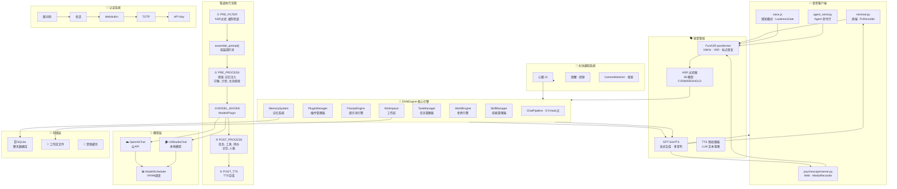

# DSN-exp

**开口即达。** 一个以语音为第一交互界面的 AI 伴侣，运行在你的机器上——你说话它就听，听完就做，做完就说，不等你敲键盘。

[](https://python.org)
[](LICENSE)
[](https://github.com/ccjjfdyqlhy/DSN-exp)

[深入了解仓库复杂度](REPORT_zh.md)  

[English](README.md) | **简体中文**

---

```
你走进来，它听见了。
  "一小时后提醒我推送构建。"
你倒咖啡的功夫，它已经处理完了。
  "设好了。对了，构建日志看起来没问题。"
你没让它检查。它知道什么值得说。
```

---

## 为什么是语音优先？

市面上所谓的"AI 助手"，本质是套了聊天气泡的网页搜索。DSN-exp 从头到尾是反过来的：

- **输入**：麦克风 → ASR (FunASR paraformer) → ASR 过滤 (1B 分类器滤除环境噪音) → AI
- **输出**：AI → 流式 TTS (GPT-SoVITS)，每句话边生成边播，不等整段合成完
- **主动**：心跳每 2 秒轮询——提醒、闹钟、甚至摄像头看到场景变化，AI 都会主动开口
- **感知通话模式**：连续对话，AI 切换为口语短句风格，沉默 = 还在听
- **万物皆可说**：50+ 技能、100+ 工具、记忆检索、闹钟管理、音乐控制、系统操作——全用嘴完成

**它不等着你打字。它跟你待在同一个房间里。不是云服务。不是 SaaS。一个在你硬盘上苏醒的智能体。**

---

## 🏗️ 系统架构



---

## 🎯 核心定位

| 特性 | 说明 |
|------|------|
| **🎤 语音优先** | ASR → TTS 管线作为主要交互通道，感知免提模式实现无手对话 |
| **🔒 完全私有** | 所有数据本地存储，SQLite加密，零云依赖 |
| **🧠 长期记忆** | 对话自动摘要+向量检索，真正记得你说过的话 |
| **🎭 多人格系统** | YAML角色卡+50维性格向量，支持人格蒸馏 |
| **🌍 世界模拟** | 天气、时间、地点动态变化，AI有自己的"生活" |
| **🛠️ 54+技能** | 搜索、文件、GitHub、音乐、文档、系统操作... |
| **⚡ 异步任务** | 慢速工具后台执行，心跳轮询实时反馈 |
| **🔐 多层认证** | 配对码/会话/WebAuthn/TOTP/API Key 五层防护 |
| **🤖 Agent API** | 本地AI Agent专用接口，双向记忆同步 |

---

## ✨ 详细功能

### 🎤 语音交互
- **实时 ASR**：FunASR paraformer-zh，含 VAD 静音检测、噪音门控、标点恢复
- **智能过滤**：1B 参数模型实时分类——是对话（FORWARD）还是噪音（HOLD），防止误触发
- **流式 TTS**：GPT-SoVITS 逐句合成，AI 说一句播一句，没有沉默空档
- **多音色切换**：运行中切换 TTS Profile，每套独立 GPT/SoVITS 权重
- **感知通话模式**：连续对话——AI 自动去掉 Markdown，改用口语短句，沉默 = 还在听
- **TTS 预处理**：LLM 清理文本，"AI 3秒后处理 HTTP 请求" → "人工智能三秒后处理超文本传输协议请求"——所有行在**一次批量调用**里完成（流式时首行仍走本地正则快路径），不再逐行串行调用 LLM
- **语义音频缓存**：L1 静态 + L2 向量 + L3 槽位——重复查询直接命中缓存音频

### 💬 智能对话
- **双后端支持**：OpenAI兼容API (DeepSeek/智谱/OpenAI) + 本地LMStudio
- **原生Tool Call**：OpenAI Function Calling，100+工具一键调用
- **工具箱模式**：两阶段工具激活——首轮只发一个 `toolbox` 索引工具，激活后才附带具体工具 schema。约 100 个工具时单任务 prompt token 可省 ~69%（首轮 ~4.7k vs 全量 ~10.9k）。问"你能做什么"时直接按索引回答，无需激活任何工具
- **历史裁剪**：`MODEL_MAX_HISTORY`（默认12）限制对话历史条数，保持 prompt 精简
- **流式输出**：实时生成，边说边播
- **语义缓存**：L1静态+L2向量+L3槽位，拦截重复请求

### 🧠 记忆系统
- **自动摘要**：LLM驱动压缩，AES-256-GCM加密
- **向量检索**：768维语义搜索，支持模糊查询
- **全局记忆**：跨聊天历史共享，真正的长期记忆
- **记忆类型**：对话摘要(`exp`) + 手动备忘(`memo`)

### 🎭 人格系统V3
- **角色卡**：YAML格式，支持自然语言/语料库/经验条目
- **蒸馏引擎**：从对话中提取性格特征，生成50维向量
- **动态合成**：基于当前情绪和语境动态生成提示词
- **性格维度**：社交、思维、情感、兴趣、行为、价值观...
- **后台节流**：`fastcache` 模式下，情绪分析与记忆摘要作为延迟后台任务执行，带同用户冷却间隔，避免本地 GPU 推理与主回复争抢

### 🌍 世界系统
- **世界引擎**：天气、时间、地点自动变化
- **叙事模型**：独立LLM实例，生成第三人称旁白
- **动作叙述**：收集AI操作，生成人类可读描述
- **世界预设**：默认世界 + 自定义世界配置

### 🛠️ 技能系统
- **54+内置技能**：
  - 🔍 `web_search` - 网络搜索
  - 📂 `file_manager` - 文件管理
  - 🐙 `github` - GitHub操作
  - 🎵 `ncm_music` - 网易云音乐
  - 📄 `document` - 文档处理 (扫描仪/打印机)
  - 💻 `system` - 系统操作
  - 🧠 `plan` - 计划管理
  - 🔧 `browser_use` - 浏览器自动化
  - 📝 `todo` - 待办事项
  - 🎭 `impression` - 印象系统
  - 🧪 `skillmgr` - 技能管理
  - ...
- **自定义技能**：YAML配置，支持异步执行
- **技能蒸馏**：从使用中学习，优化调用

### ⏰ 主动通知系统
- **心跳轮询**：客户端每 2 秒 polling，随时接收 AI 主动消息
- **提醒系统**：倒计时、每日计划、Cron 周期、习惯打卡——到期自动 AI+TTS 播报
- **闹钟系统**：完整增删改查，按周循环，语音 dismiss
- **主动视觉**：CameraWatcher 后台抓帧 → VisionModel 分析场景变化 → AI 自主决定是否开口

### ⚡ 任务系统
- **复杂度分析**：自动判断是否需要异步执行
- **异步任务**：慢速工具后台执行
- **心跳轮询**：前端轮询获取异步结果
- **实时反馈**：Agent循环每步骤实时TTS进度
- **超步数汇报**：Agent 用完全部步数仍在执行工具时，追加一轮把工具结果总结给用户，而不是无声终止

### 🖼️ 视觉系统
- **VisionModel**：通用视觉模型 (GLM-4.6V/GPT-4V)
- **OCRModel**：文档OCR，支持deepseek-ocr
- **VISION_OVERRIDE**：接管OCR+2md管线，直接生成Markdown
- **图片分析**：`describe_image`工具支持本地图片
- **主动视觉**：后台 CameraWatcher 线程实现场景感知
- **多摄像头并行**：`look_around` 并行描述所有摄像头（按逻辑名保序），多摄延迟减半
- **按需帧缓存**：客户端缓存每台摄像头最近一帧，视觉请求零等待复用；心跳降到 2s，请求几乎即时送达
- **VLM 预热**：启动时后台发一次 dummy 请求，消除首次推理冷启动（首次 VLM 推理可能 ~9s）
- **look_around 去重**：短窗口内重复观察直接复用上次结果，不再重复抓帧+推理
- **快速兜底**：客户端离线时 `look_around` 8s 内返回兜底（原 20s），不再拖住整条回复

### 🔐 认证系统
| 层级 | 方法 | 优先级 | 使用场景 |
|------|------|--------|----------|
| L4 | API Key | 1 | Agent API / 自动化 |
| L1 | Session | 2 | 终端/Web UI |
| L2 | WebAuthn | 3 | 通行密钥 |
| L3 | TOTP | 4 | 双因素认证 |
| L0 | 配对码 | 5 | 首次设备配对 |

### 🧩 其他功能
- **工作区系统**：用户隔离目录，AI笔记/扫描件/代码仓库
- **文档系统**：扫描仪/打印机支持，`.hmd`格式
- **维护系统**：自动内存压缩/人格蒸馏/日志清理
- **语义缓存**：拦截重复请求，节省Token
- **Agent API**：本地AI Agent专用接口

---

## 🚀 快速开始

### 最小化配置 (3步启动)

#### 1️⃣ 克隆并安装
```bash
git clone https://github.com/ccjjfdyqlhy/DSN-exp
cd DSN-exp
pip install -r requirements.txt
```

#### 2️⃣ 配置 (自动引导)
```bash
python main.py
```

首次运行会进入交互式引导，询问：
- API选择：云API或本地模型
- API Key和Base URL
- 主模型选择
- 是否启用核心功能

引导完成后自动生成`.env`文件。

#### 3️⃣ 连接客户端
```bash
# 终端语音客户端（按住 Enter 说话，松开发送）
python psychoscope/minimal.py

# Web界面（支持感知免提模式）
python psychoscope/server.py
# 然后访问 http://localhost:5000
```

**就这么简单！** 现在可以开始说话了。

---

### 常见配置场景

#### 🌐 场景1：纯DeepSeek (最简单)
```bash
# .env (引导会自动生成)
OPENAI_API_KEY=sk-your-deepseek-key
OPENAI_API_BASE=https://api.deepseek.com/v1
MAIN_MODEL_NAME=deepseek-v4-flash
```

#### 🏠 场景2：本地LMStudio
```bash
# .env
MAIN_MODEL_TYPE=lmstudio
MAIN_MODEL_NAME=llama-3-8b-instruct
LMSTUDIO_BASE_URL=http://localhost:4501

# 先启动LMStudio，加载模型
# 然后启动DSN-exp
python main.py
python psychoscope/minimal.py
```

#### 🎯 场景3：智谱GLM
```bash
# .env
OPENAI_API_KEY=your-zhipu-key
OPENAI_API_BASE=https://open.bigmodel.cn/api/paas/v4
MAIN_MODEL_NAME=glm-4.7
VISION_API_KEY=your-zhipu-key
VISION_MODEL_NAME=glm-4.6v
```

#### 🤖 场景4：Agent API
```bash
# 服务器控制台创建Agent
/agent create MyAgent 1
# → 输出API Key

# 使用Agent发送消息
python agent_send.py "分析代码复杂度"
```

---

## 📂 项目结构

```
DSN-exp/
├── 🚀 核心
│   ├── main.py                 # 服务器入口 + 控制台
│   ├── engine.py               # DSNEngine 核心引擎
│   ├── boot.py                 # Flask 应用初始化 + ASR/TTS 模型加载
│   ├── config.py               # 配置管理
│   └── onboarding.py           # 首次启动引导
│
├── 🔌 插件系统
│   ├── plugins/
│   │   ├── base.py             # 插件基类 + HookPoint
│   │   ├── manager.py          # PluginManager
│   │   ├── pipeline.py         # ChatPipeline 对话管道
│   │   └── builtin/            # 内置插件
│   │       ├── models_plugin.py    # 模型调用
│   │       ├── memory_plugin.py    # 记忆系统
│   │       ├── vision_plugin.py    # 视觉系统
│   │       ├── task_plugin.py      # 任务管理
│   │       ├── tts_plugin.py       # TTS 合成
│   │       ├── tts_profile.py      # TTS 音色配置
│   │       ├── asr_filter_plugin.py # ASR 语音过滤器
│   │       ├── active_vision_plugin.py # 摄像头观察器
│   │       └── ...
│   │   └── custom/             # 自定义插件
│
├── 🧠 记忆系统
│   ├── memory/core.py          # MemorySystem 核心类
│   └── semantic_cache/         # 语义缓存 (L1/L2/L3)
│
├── 🎭 人格系统
│   ├── prompt/personality_v3/  # PersonalitySystemV3
│   │   ├── character_card.py   # 角色卡定义
│   │   ├── distillation_engine.py  # 蒸馏引擎
│   │   ├── dynamic_synthesizer.py # 动态合成器
│   │   ├── traits.py           # 50维性格向量
│   │   └── ...
│   ├── prompt/personality_v2/  # PersonalitySystemV2
│   ├── prompt/library.py       # PromptLibrary
│   ├── prompt/engine.py        # PromptEngine
│   └── character_cards/        # YAML 角色卡
│
├── 🌍 世界系统
│   ├── world/
│   │   ├── engine.py           # WorldEngine
│   │   ├── state_manager.py    # WorldStateManager
│   │   ├── narrative_model.py  # NarrativeModel
│   │   ├── action_narrator.py  # 动作叙述
│   │   └── worlds/             # 世界配置
│
├── 🛠️ 技能系统
│   ├── skills/
│   │   ├── registry.py         # SkillRegistry
│   │   ├── manager.py          # SkillManager
│   │   ├── builtin/            # 内置技能 54+
│   │   ├── custom/             # 自定义技能
│   │   ├── distilled/          # 蒸馏技能
│   │   └── system/             # 系统技能
│
├── ⚡ 任务系统
│   ├── tasks.py                # TaskManager + 复杂度分析
│   ├── maintenance/            # 后台任务
│   └── async_task_store.py     # 异步任务存储
│
├── 🤖 模型客户端
│   ├── models/
│   │   ├── clients.py          # OpenAIChat + LMStudioChat
│   │   ├── scheduler.py        # ModelScheduler
│   │   ├── tts_process.py      # TTS 预处理
│   │   └── asr_filter.py       # ASR 过滤 (1B 模型)
│
├── 🔐 认证系统
│   ├── auth/
│   │   ├── auth_manager.py     # 认证管理器
│   │   ├── api_key_manager.py  # API Key
│   │   ├── webauthn_manager.py # WebAuthn
│   │   ├── totp_manager.py     # TOTP
│   │   ├── pairing.py          # 配对码
│   │   ├── session.py          # 会话管理
│   │   └── endpoints.py        # 认证API
│
├── 💾 数据库
│   ├── db/
│   │   ├── chat.py             # ChatDBManager
│   │   ├── plan_store.py       # 计划存储
│   │   └── plan_engine.py      # 计划引擎
│
├── 🖼️ 视觉系统
│   ├── document/               # 文档处理 (.hmd)
│   └── models/clients.py       # VisionModel + OCRModel
│
├── 🎤 音频系统
│   ├── audio/infer.py          # VocalExp — GPT-SoVITS 客户端
│   └── TTS_profiles/           # TTS 音色配置
│
├── 🗣️ 语音 API
│   ├── api/app.py              # ASR 识别 + passthrough 端点
│   ├── api/heartbeat.py        # 心跳通知轮询
│   └── api/alarm.py            # 闹钟 CRUD + dismiss
│
├── 🖥️ 前端客户端
│   ├── psychoscope/
│   │   ├── server.py           # Web 服务器
│   │   ├── minimal.py          # 终端语音客户端
│   │   └── static/
│   │       ├── index.html
│   │       ├── js/app.js       # 主 Web 应用
│   │       ├── js/voice.js     # 浏览器感知模式
│   │       └── js/typewriter.js
│   └── agent_send.py           # Agent CLI
│
├── 📊 配置文件
│   ├── .env.example            # 配置示例
│   ├── model_profiles/         # 模型配置
│   └── world/worlds/           # 世界配置
│
├── 🧪 测试与文档
│   ├── tests/                  # 测试
│   ├── docs/                   # 文档
│   ├── REPORT.md               # 技术报告
│   └── GOALS.md                # 开发目标
│
└── 📂 工作区与缓存
    ├── .dsn/workspace/         # 用户工作区
    ├── logs/                   # 日志（含 ASR/TTS 调试日志）
    └── temp/                   # 临时文件
```

---

## 📦 核心模块介绍

### 🎤 语音管线

**三级语音处理：ASR → 过滤 → AI → TTS**

```
麦克风 → PCM 16kHz → FunASR (VAD + 识别) → ASR 过滤器 (FORWARD/HOLD)
                                                    │
                                                    ├── FORWARD → ChatPipeline → GPT-SoVITS TTS → 扬声器
                                                    └── HOLD → 丢弃（记录到记忆系统作为环境音）
```

**组件：**
- **FunASR**：paraformer-zh 模型，fsmn-vad 做静音检测，ct-punc-c 做标点恢复，支持 CUDA/CPU
- **ASR 过滤器**：1B 参数 LMStudio 模型分类语音为对话或噪音，维护 20 轮对话历史防误判
- **GPT-SoVITS TTS**：通过 REST API 流式合成，支持并行/串行架构，多音色切换
- **TTS 预处理器**：两级清理——正则去 Markdown，LLM 转换数字/缩写到自然语音；多行合并为一次批量调用（流式首行走本地正则快路径）
- **语义音频缓存**：L1 静态语素 + L2 向量语义 + L3 槽位注册

### 🔄 ChatPipeline 对话管道
**5个Hook点，完整的对话生命周期管理**

| HookPoint | 触发时机 | 用途 |
|-----------|----------|------|
| PRE_FILTER | 管道起始 | ASR 过滤、语义缓存检查、HOLD 时短路 |
| PRE_PROCESS | 模型调用前 | 记忆注入、视觉处理、主动视觉、印象、计划 |
| MODEL_INVOKE | 模型调用 | OpenAI/LMStudio调用、工具传递、Agent 循环 |
| POST_PROCESS | 输出后 | 任务执行、工具调用、记忆更新、人格更新 |
| POST_TTS | 文本就绪后 | TTS 合成、缓存、音频投递 |

### 🧠 MemorySystem 记忆系统
**双层架构：摘要 + 向量检索**

```
对话 → LMSummaryModel → 压缩摘要 → AES-256加密 → SQLite
         ↓
    EmbeddingClient → 768维向量 → 语义检索
```

**特性：**
- 自动摘要：每N轮自动压缩对话
- 向量检索：支持语义模糊搜索
- 全局记忆：跨聊天历史共享
- 加密存储：AES-256-GCM保护隐私

### 🎭 PersonalitySystemV3 人格系统
**50维性格向量，真正的人格建模**

**核心组件：**
- **CharacterCard**：YAML角色卡，支持自然语言/语料库/经验条目
- **DistillationEngine**：从对话中提取性格特征
- **DynamicSynthesizer**：基于情绪和语境动态生成提示词
- **PersonalityJudge**：50维性格向量：社交/思维/情感/兴趣/行为/价值观

**工作流程：**
```
角色卡(YAML) → 蒸馏引擎 → 50维向量 → 动态合成器 → 提示词 → 模型
```

### 🌍 WorldSystem 世界系统
**AI有自己的"生活"**

**组件：**
- **WorldEngine**：世界状态管理（天气/时间/地点）
- **WorldStateManager**：状态更新和事件触发
- **NarrativeModel**：独立LLM实例，生成旁白
- **ActionNarrator**：收集AI操作，生成描述

**示例：**
```
世界：default
天气：晴天 ☀️
时间：2026-07-03 14:30
地点：书房 📚
旁白：阳光透过窗户洒在书桌上，AI正在思考用户的请求...
```

### 🛠️ SkillSystem 技能系统
**54+内置技能 + 自定义技能**

**技能结构：**
```yaml
name: web_search
description: 网络搜索
version: 1.0
tools:
  - name: search
    description: 搜索网络
    parameters:
      query:
        type: string
        description: 搜索关键词
```

**内置技能列表：**
- 🔍 `web_search` - 网络搜索
- 📂 `file_manager` - 文件管理
- 🐙 `github` - GitHub操作
- 🎵 `ncm_music` - 网易云音乐
- 📄 `document` - 文档处理
- 💻 `system` - 系统操作
- 🧠 `plan` - 计划管理
- 🔧 `browser_use` - 浏览器自动化
- 📝 `todo` - 待办事项
- 🎭 `impression` - 印象系统
- 🧪 `skillmgr` - 技能管理
- ...

### ⏰ 主动通知系统
**心跳驱动的主动 AI 语音通知**

```
(时钟滴答) → TaskManager 触发 → task_notifications 表
                                        ↓
HeartbeatPoller (2s) → GET /api/heartbeat → has_notification?
                                        ├── 是 → 构建提示词 → AI 回复 → TTS → 播报
                                        └── 否 → 继续休眠
```

**触发来源：**
- **提醒**：倒计时、每日计划、Cron 周期、习惯打卡
- **闹钟**：按周循环，支持 dismiss（8 天静音）
- **主动视觉**：CameraWatcher 后台抓帧 → VisionModel 场景分析 → 变化检测

### ⚡ TaskSystem 任务系统
**智能异步，实时反馈**

**特性：**
- **复杂度分析**：自动判断是否需要异步
- **异步任务**：慢速工具后台执行
- **心跳轮询**：前端轮询获取结果
- **实时反馈**：每步骤TTS进度推送
- **超步数汇报**：步数用尽且工具未结束时不无声终止，追加一轮把结果总结给用户

**工作流程：**
```
用户请求 → 复杂度分析 → 高复杂度? → 异步任务 → 心跳轮询 → 结果返回
                     ↓
                  低复杂度 → 同步执行 → 直接返回
```

### 🔐 AuthSystem 认证系统
**五层防护，安全可控**

**认证层级：**
1. **L4 API Key**：程序化访问，Agent API
2. **L1 Session**：终端/Web UI登录
3. **L2 WebAuthn**：通行密钥，硬件认证
4. **L3 TOTP**：时间-based双因素认证
5. **L0 配对码**：首次设备配对

**流程示例：**
```bash
# 1. 生成配对码
/newbind
# → 配对码: 12345678 (8分钟有效)

# 2. 客户端提交
POST /api/auth/pairing/verify
{"code": "12345678"}

# 3. 返回Session
{"session": "eyJhbGciOiJIUzI1NiIs..."}
```

### 🖼️ VisionSystem 视觉系统
**多模态感知**

**组件：**
- **VisionModel**：通用视觉模型 (GLM-4.6V/GPT-4V)
- **OCRModel**：文档OCR (deepseek-ocr)
- **VISION_OVERRIDE**：接管OCR+2md管线

**视觉管线：**
```
图片 → VisionModel → 描述文本
文档 → OCRModel → Markdown → .hmd
```

---

## 🎮 使用技巧

### 终端语音客户端快捷键
```
[Enter]   按住录音，松开发送
[a 双击]  锁定/解锁面板
[b 双击]  音乐播放器模式
[p]       显示人格状态
[s]       切换待机/唤醒
[i]       系统信息
[k]       跳过最新提醒
[f]       静音闹钟 + 停止TTS
[r]       手动触发心跳
[t]       文字输入（同步）
[=]       异步任务（长时间）
[h]       显示帮助
[q/Ctrl+C] 退出
```

### 服务器控制台命令
```
/newbind           - 生成新配对码
/users             - 列出所有用户
/status            - 服务器状态
/agent create      - 创建Agent
/agent bind        - 绑定Agent到用户
/memory query      - 搜索记忆
/memory reindex    - 重建向量索引
/hibernate sleep   - 进入待机
/config set        - 动态修改配置
/stop              - 停止服务器
```

### API调用示例
```bash
# 发送消息
curl -X POST http://localhost:5000/api/chat/send \
  -H "Authorization: Bearer YOUR_SESSION" \
  -H "Content-Type: application/json" \
  -d '{"message": "你好"}'

# 语音直通（ASR → AI → TTS）
curl -X POST http://localhost:5000/api/asr/passthrough \
  -H "Authorization: Bearer YOUR_SESSION" \
  -H "Content-Type: application/json" \
  -d '{"audio_b64": "BASE64_WAV_DATA"}'

# Agent发送消息
python agent_send.py "分析代码复杂度"

# 搜索记忆
curl "http://localhost:5000/api/memory/query?q=Python项目&limit=5"
```

---

## ⚙️ 核心配置

### 最小配置 (必需)
```bash
OPENAI_API_KEY=sk-your-key              # API密钥
OPENAI_API_BASE=https://api.deepseek.com/v1  # API地址
MAIN_MODEL_NAME=deepseek-v4-flash       # 主模型
```

### 语音完整配置 (推荐)
```bash
# 语音
ASR_ENABLED=true
ASR_DEVICE=cuda
TTS_BASE_URL=http://127.0.0.1:9880
TTS_PROCESS_ENABLED=true

# 主模型
MAIN_MODEL_TYPE=openai
MAIN_MODEL_NAME=deepseek-v4-flash

# 记忆系统
MEMORY_ENABLED=true
MEMORY_EMBEDDING_ENABLED=true

# 人格系统
PERSONALITY_V3_ENABLED=true

# 世界系统
WORLD_ENABLED=true
NARRATIVE_ENABLED=true

# 语义缓存
SEMANTIC_CACHE_ENABLED=true
```

### 性能与感知调优
```bash
# 工具箱：首轮只发 toolbox 索引，激活后才附带具体工具 schema
TOOLBOX_ENABLED=true

# 主模型历史条数上限（非 system 消息）
MODEL_MAX_HISTORY=12

# Agent 最大步数；步数用尽但任务未结束时会自动追加一轮向用户汇报
AGENT_MAX_STEPS=15

# 视觉：启动预热 VLM、look_around 短时去重窗口（秒）
VISION_WARMUP=true
VISION_LOOK_AROUND_DEDUP=10

# 客户端侧 (minimal.py)：心跳间隔(秒)、缓存帧新鲜度(秒)
#   DSN_HEARTBEAT_INTERVAL=2
#   DSN_FRAME_CACHE_MAX_AGE=3

# 本地 GPU 后台任务节流（秒）
HIBERNATE_PERSONALITY_COOLDOWN=30
HIBERNATE_MEMORY_COOLDOWN=60
```

### 完整配置列表
查看 [`.env.example`](.env.example) 获取所有配置项。

---

## 📄 许可证

MIT License - 详见 [LICENSE](LICENSE) 文件

---

**[⬆ 回到顶部](#-dsn-exp)**

Made with ❤️ by [Darkstar](https://github.com/ccjjfdyqlhy)
